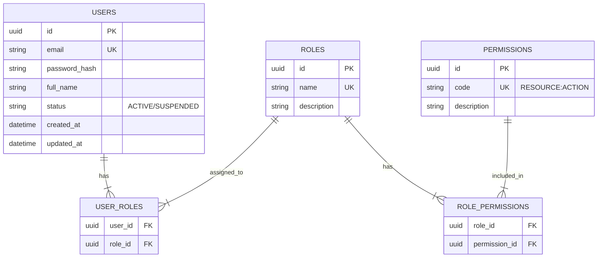

# IAM & Security Module Overview

> Dokumen ini memberikan gambaran umum untuk modul Identity and Access Management (IAM) & Security.

---

## Header & Navigation

- [Back to Module Overview](../README.md)
- [Link ke All Modules](../../README.md)

---

## 1. Module Overview

- **Deskripsi singkat modul:** Modul IAM & Security bertanggung jawab atas manajemen identitas pengguna, otentikasi (verifikasi identitas), dan otorisasi (hak akses) dalam sistem.
- **Posisi modul dalam sistem:** Core Module. Modul ini menjadi fondasi keamanan bagi modul-modul lain.
- **Hubungan dengan domain bisnis utama:** Melindungi data bisnis dan memastikan bahwa fitur hanya diakses oleh pihak yang berwenang.

---

## 2. Purpose & Business Value

### 2.1 Tanggung Jawab Utama
- Mengelola data pengguna, peran, dan hak akses.
- Menangani proses Login, Register, dan keamanan akun.

### 2.2 Nilai Bisnis
- **Compliance:** Memenuhi standar keamanan data dan privasi pengguna (misal: GDPR/PDP).
- **Risk reduction:** Mencegah akses tidak sah yang berpotensi merugikan bisnis.
- **Operational efficiency:** Sentralisasi manajemen akses memudahkan administrasi.

---

## 3. Scope & Detailed Specifications

Modul ini dibagi menjadi beberapa spesifikasi fungsional terpisah:

- **[Authentication Specification](./authentication.md)**
  - Login, Register, Forgot Password, Reset Password.
- **[User Management Specification](./user-management.md)**
  - CRUD User, Block/Suspend User.
- **[Role & Permission Management Specification](./role-permission-management.md)**
  - CRUD Role, Assign Permissions, RBAC.

---

## 4. Data Model

### 4.1 Entity Relationship Diagram (ERD)

---

## 5. Dependencies

### 5.1 Required Modules
- **Database Module:** Untuk koneksi ke database (PostgreSQL/MySQL).
- **Email Service:** Untuk mengirim email reset password & verifikasi.

---

## 6. Compliance & Audit

- **Password Hashing:** Wajib menggunakan algoritma kuat (Bcrypt/Argon2).
- **Audit Logs:** Mencatat setiap aktivitas login dan perubahan hak akses.

---

## 7. Implementation Tasks

| Task ID | Platform | Status | Description |
| :--- | :--- | :--- | :--- |
| IAM-01 | Backend | Todo | Setup database schema (Users, Roles, Permissions). |
| IAM-02 | Backend | Todo | Implement [Authentication](./authentication.md) endpoints. |
| IAM-03 | Backend | Todo | Implement [User Management](./user-management.md) endpoints. |
| IAM-04 | Backend | Todo | Implement [Role & Permission](./role-permission-management.md) endpoints. |
