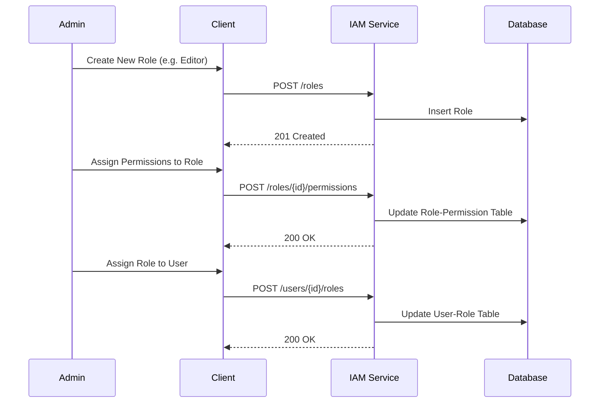

# Role & Permission Management Specification

> Dokumen ini menjelaskan detail spesifikasi teknis untuk fitur Role dan Permission Management.

---

## 1. User Stories

| ID | Role | Goal | Benefit |
| :--- | :--- | :--- | :--- |
| US-04 | Admin | Membuat Role baru | Mengelompokkan hak akses pengguna |
| US-05 | Admin | Menetapkan Permission ke Role | Mengatur apa yang bisa dilakukan oleh Role tertentu |
| US-11 | Admin | Assign Role ke User | Memberikan wewenang kepada user |

---

## 2. Business Flow

### 2.1 Role & Permission Assignment Flow



---

## 3. API Schema

### 3.1 Create Role
- **Endpoint:** `POST /api/v1/roles`
- **Request:**
  ```json
  {
    "name": "EDITOR",
    "description": "Can edit content"
  }
  ```
- **Response:** `201 Created`

### 3.2 List Roles
- **Endpoint:** `GET /api/v1/roles`
- **Response:** `[{"id": "...", "name": "EDITOR"}]`

### 3.3 Assign Permissions
- **Endpoint:** `POST /api/v1/roles/:id/permissions`
- **Request:**
  ```json
  {
    "permission_ids": ["uuid-perm-1", "uuid-perm-2"]
  }
  ```
- **Response:** `200 OK`

### 3.4 List Permissions
- **Endpoint:** `GET /api/v1/permissions`
- **Response:** `[{"id": "...", "code": "ARTICLE:CREATE"}]`
