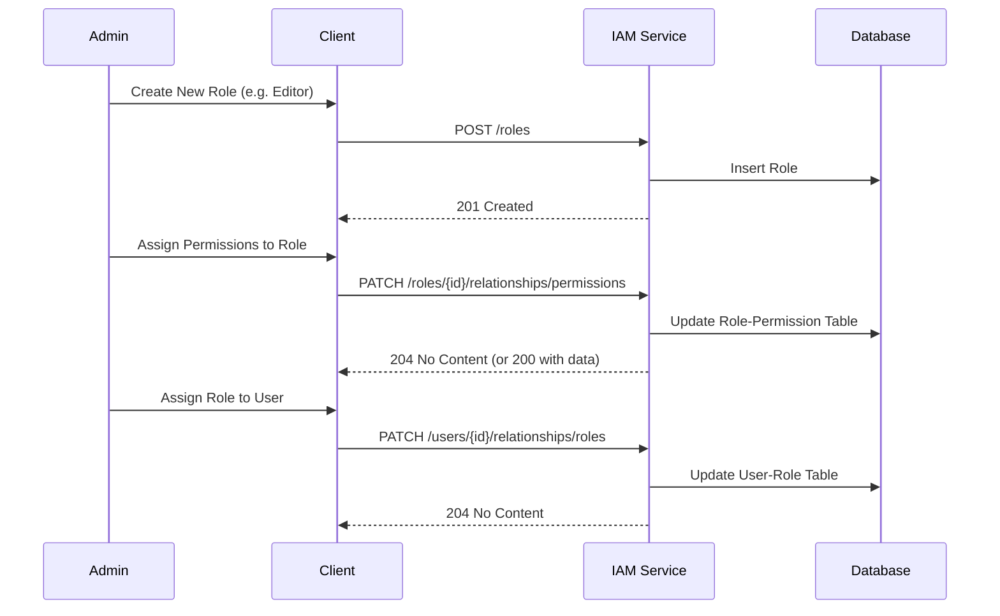

# Role & Permission Management Specification

> Dokumen ini menjelaskan detail spesifikasi teknis untuk fitur Role dan Permission Management.

---

## Header & Navigation

- [Back to IAM Overview](./overview.md)
- [Link ke All Modules](../../README.md)

---

## 1. Feature Overview

- **Deskripsi singkat:** Fitur untuk mengelola Role-Based Access Control (RBAC).
- **Posisi dalam modul:** Komponen inti dari IAM & Security.
- **Hubungan dengan domain bisnis utama:** Menentukan siapa boleh melakukan apa.

---

## 2. Purpose & Business Value

### 2.1 Tanggung Jawab Utama
- Membuat dan mendefinisikan Role (Peran).
- Menetapkan Permission (Hak Akses) ke Role.
- Menetapkan Role ke User.

### 2.2 Nilai Bisnis
- **Security:** Granular access control meminimalkan risiko privilege escalation.
- **Flexibility:** Mudah menyesuaikan hak akses tanpa mengubah kode (konfigurasi data).

---

## 3. Scope

### 3.1 In-Scope
- CRUD Roles.
- List Permissions (Read-only from code/seed).
- Assign Permissions to Role.
- Assign Roles to User.

### 3.2 Out-of-Scope
- Dynamic Permission Creation (Permission biasanya hardcoded di level aplikasi dan di-seed ke DB).

---

## 4. User Stories

| ID | Role | Goal | Benefit |
| :--- | :--- | :--- | :--- |
| US-04 | Admin | Membuat Role baru | Mengelompokkan hak akses pengguna |
| US-05 | Admin | Menetapkan Permission ke Role | Mengatur apa yang bisa dilakukan oleh Role tertentu |
| US-11 | Admin | Assign Role ke User | Memberikan wewenang kepada user |

---

## 5. Business Flow & Rules

### 5.1 Business Flow

#### Role & Permission Assignment Flow


### 5.2 Business Rules
- **Super Admin:** Role `SUPER_ADMIN` memiliki semua permission secara default dan tidak bisa dihapus.
- **Unique Name:** Nama Role harus unik.

---

## 6. Data Model

Referensi ke entitas: `Roles`, `Permissions`, `RolePermissions`, `UserRoles`.
Lihat [IAM Overview - ERD](./overview.md#6-data-model).

---

## 7. Feature Details (API Specification)

**Strict Rule:** All API endpoints must strictly follow the **JSON:API** standard (https://jsonapi.org).
- **Content-Type:** `application/vnd.api+json`
- **Top-level members:** `data`, `errors`, `meta`, `links`, `included`.

### 7.1 Create Role
- **Endpoint:** `POST /api/v1/roles`
- **Request Headers:**
  - `Content-Type: application/vnd.api+json`
- **Request Body:**
  ```json
  {
    "data": {
      "type": "roles",
      "attributes": {
        "name": "EDITOR",
        "description": "Can edit content"
      }
    }
  }
  ```
- **Response (201 Created):**
  ```json
  {
    "data": {
      "type": "roles",
      "id": "role-uuid-1",
      "attributes": {
        "name": "EDITOR",
        "description": "Can edit content"
      },
      "links": {
        "self": "/api/v1/roles/role-uuid-1"
      }
    }
  }
  ```

### 7.2 List Roles
- **Endpoint:** `GET /api/v1/roles`
- **Request Headers:**
  - `Accept: application/vnd.api+json`
- **Response:**
  ```json
  {
    "data": [
      {
        "type": "roles",
        "id": "role-uuid-1",
        "attributes": {
          "name": "EDITOR",
          "description": "Can edit content"
        },
        "links": {
            "self": "/api/v1/roles/role-uuid-1"
        }
      }
    ],
    "links": {
        "self": "/api/v1/roles"
    }
  }
  ```

### 7.3 List Permissions
- **Endpoint:** `GET /api/v1/permissions`
- **Request Headers:**
  - `Accept: application/vnd.api+json`
- **Response:**
  ```json
  {
    "data": [
      {
        "type": "permissions",
        "id": "perm-uuid-1",
        "attributes": {
          "code": "ARTICLE:CREATE",
          "description": "Can create articles"
        },
        "links": {
            "self": "/api/v1/permissions/perm-uuid-1"
        }
      }
    ],
    "links": {
        "self": "/api/v1/permissions"
    }
  }
  ```

### 7.4 Assign Permissions to Role (Update Relationship)
- **Endpoint:** `PATCH /api/v1/roles/:id/relationships/permissions`
- **Request Headers:**
  - `Content-Type: application/vnd.api+json`
- **Request Body:**
  ```json
  {
    "data": [
      { "type": "permissions", "id": "perm-uuid-1" },
      { "type": "permissions", "id": "perm-uuid-2" }
    ]
  }
  ```
- **Response:** `204 No Content` (Success)

### 7.5 Assign Roles to User (Update Relationship)
- **Endpoint:** `PATCH /api/v1/users/:id/relationships/roles`
- **Request Headers:**
  - `Content-Type: application/vnd.api+json`
- **Request Body:**
  ```json
  {
    "data": [
      { "type": "roles", "id": "role-uuid-1" }
    ]
  }
  ```
- **Response:** `204 No Content`

---

## 8. Dependencies

### 8.1 Required Modules
- **Database:** Akses tabel RBAC.

---

## 9. Integration Points

### 9.1 Inbound
- **Middleware:** Authorization middleware akan mengecek permission user berdasarkan role yang dimiliki.

---

## 10. Compliance & Audit

- **Audit:** Setiap perubahan role atau permission assignment harus dicatat.

---

## 11. Implementation Tasks

**Strict Rule:** Every backend task that involves a user interface must have a corresponding frontend task.

| Task ID | Platform | Status | Description |
| :--- | :--- | :--- | :--- |
| RBAC-01 | Backend | Todo | Implement CRUD Roles |
| RBAC-02 | Frontend | Todo | Implement Role Management Page (List, Create, Edit) |
| RBAC-03 | Backend | Todo | Implement `PATCH /relationships` endpoints |
| RBAC-04 | Frontend | Todo | Implement Permission Assignment UI (Checkbox list/Transfer component) |
| RBAC-05 | Backend | Todo | Implement Permission Seeder |
