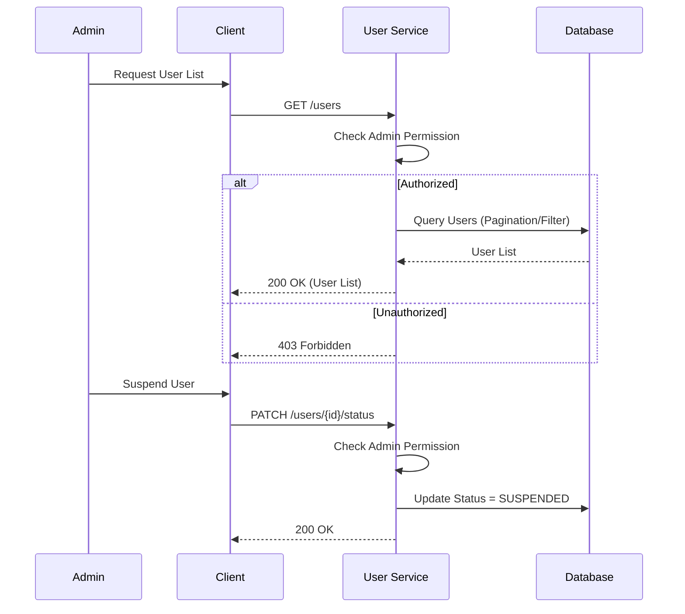

# User Management Specification

> Dokumen ini menjelaskan detail spesifikasi teknis untuk fitur User Management.

---

## 1. User Stories

| ID | Role | Goal | Benefit |
| :--- | :--- | :--- | :--- |
| US-06 | Admin | Mengelola User (Edit/Delete/Block) | Menjaga keamanan dan validitas data pengguna |
| US-09 | Admin | Melihat daftar user | Memantau pertumbuhan pengguna |
| US-10 | User | Mengupdate profil sendiri | Menjaga data diri tetap akurat |

---

## 2. Business Flow

### 2.1 Admin Manage User Flow



---

## 3. API Schema

### 3.1 List Users
- **Endpoint:** `GET /api/v1/users`
- **Query Params:** `page=1`, `limit=10`, `search=John`
- **Response:**
  ```json
  {
    "data": [
      {
        "id": "uuid-1",
        "email": "john@example.com",
        "full_name": "John Doe",
        "status": "ACTIVE"
      }
    ],
    "meta": {
      "total": 100,
      "page": 1
    }
  }
  ```

### 3.2 Update User
- **Endpoint:** `PUT /api/v1/users/:id`
- **Request:**
  ```json
  {
    "full_name": "John Updated"
  }
  ```
- **Response:** `200 OK`

### 3.3 Delete User
- **Endpoint:** `DELETE /api/v1/users/:id`
- **Response:** `204 No Content`
