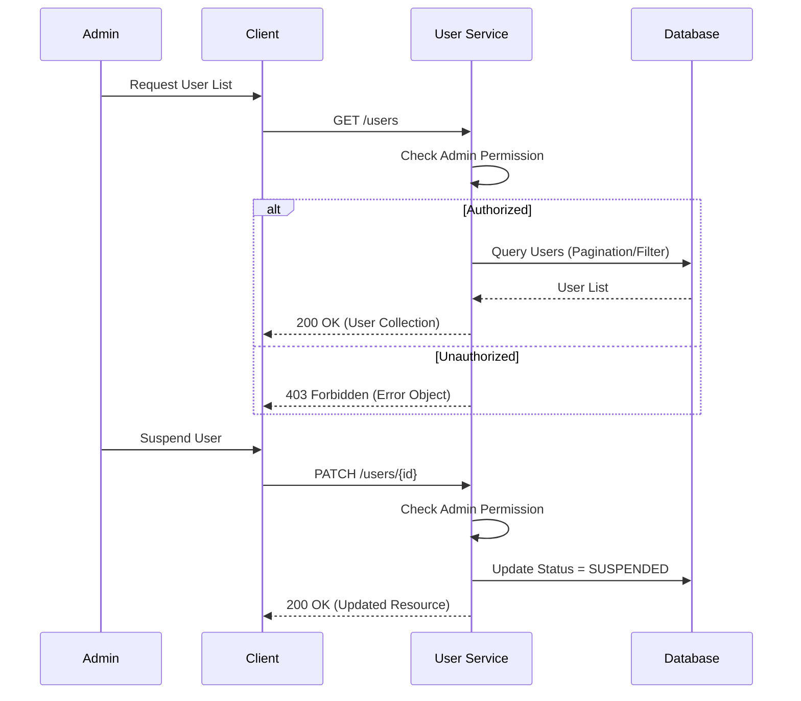

# User Management Specification

> Dokumen ini menjelaskan detail spesifikasi teknis untuk fitur User Management.

---

## Header & Navigation

- [Back to IAM Overview](./overview.md)
- [Link ke All Modules](../../README.md)

---

## 1. Feature Overview

- **Deskripsi singkat:** Fitur administratif untuk mengelola daur hidup dan data pengguna.
- **Posisi dalam modul:** Komponen inti dari IAM & Security.
- **Hubungan dengan domain bisnis utama:** Memastikan data pengguna valid dan aman.

---

## 2. Purpose & Business Value

### 2.1 Tanggung Jawab Utama
- Melihat daftar pengguna.
- Mengubah status pengguna (Active/Suspended).
- Mengupdate profil pengguna.

### 2.2 Nilai Bisnis
- **Control:** Administrator memiliki kendali penuh atas akses pengguna.
- **Support:** Membantu tim support dalam mengelola masalah akun pengguna.

---

## 3. Scope

### 3.1 In-Scope
- List Users (Pagination, Filtering).
- Get User Details.
- Update User Profile.
- Suspend/Activate User.
- Delete User (Soft Delete).

### 3.2 Out-of-Scope
- Detail profil spesifik domain (e.g., Riwayat Transaksi).

---

## 4. User Stories

| ID | Role | Goal | Benefit |
| :--- | :--- | :--- | :--- |
| US-06 | Admin | Mengelola User (Edit/Delete/Block) | Menjaga keamanan dan validitas data pengguna |
| US-09 | Admin | Melihat daftar user | Memantau pertumbuhan pengguna |
| US-10 | User | Mengupdate profil sendiri | Menjaga data diri tetap akurat |

---

## 5. Business Flow & Rules

### 5.1 Business Flow

#### Admin Manage User Flow


### 5.2 Business Rules
- **Admin Only:** Hanya user dengan role `ADMIN` yang bisa melihat list user lain.
- **Self Update:** User biasa hanya bisa update profil sendiri.
- **Immutable:** Email tidak dapat diubah sembarangan (perlu verifikasi ulang flow - future scope).

---

## 6. Data Model

Referensi ke entitas: `Users`.
Lihat [IAM Overview - ERD](./overview.md#6-data-model).

---

## 7. Feature Details (API Specification)

Semua endpoint mengikuti standar **JSON:API**.

### 7.1 List Users
- **Endpoint:** `GET /api/v1/users`
- **Query Params:** `page[number]=1`, `page[size]=10`, `filter[search]=John`
- **Response:**
  ```json
  {
    "data": [
      {
        "type": "users",
        "id": "uuid-1",
        "attributes": {
          "email": "john@example.com",
          "full_name": "John Doe",
          "status": "ACTIVE"
        },
        "links": {
          "self": "/api/v1/users/uuid-1"
        }
      }
    ],
    "meta": {
      "total_pages": 10,
      "total_items": 100
    },
    "links": {
      "self": "/api/v1/users?page[number]=1&page[size]=10",
      "next": "/api/v1/users?page[number]=2&page[size]=10",
      "last": "/api/v1/users?page[number]=10&page[size]=10"
    }
  }
  ```

### 7.2 Get Single User
- **Endpoint:** `GET /api/v1/users/:id`
- **Response:**
  ```json
  {
    "data": {
      "type": "users",
      "id": "uuid-1",
      "attributes": {
        "email": "john@example.com",
        "full_name": "John Doe",
        "status": "ACTIVE"
      },
      "links": {
        "self": "/api/v1/users/uuid-1"
      }
    }
  }
  ```

### 7.3 Update User
- **Endpoint:** `PATCH /api/v1/users/:id`
- **Request:**
  ```json
  {
    "data": {
      "type": "users",
      "id": "uuid-1",
      "attributes": {
        "full_name": "John Updated",
        "status": "SUSPENDED"
      }
    }
  }
  ```
- **Response:**
  ```json
  {
    "data": {
      "type": "users",
      "id": "uuid-1",
      "attributes": {
        "email": "john@example.com",
        "full_name": "John Updated",
        "status": "SUSPENDED"
      },
      "links": {
        "self": "/api/v1/users/uuid-1"
      }
    }
  }
  ```

### 7.4 Delete User
- **Endpoint:** `DELETE /api/v1/users/:id`
- **Response:** `204 No Content`

---

## 8. Dependencies

### 8.1 Required Modules
- **Database:** Akses tabel Users.

---

## 9. Integration Points

### 9.1 Inbound
- **Admin Dashboard:** Mengonsumsi API ini untuk manajemen user.

---

## 10. Compliance & Audit

- **Audit Log:** Mencatat siapa yang mengubah status user (Admin ID).

---

## 11. Implementation Tasks

**Strict Rule:** Every backend task that involves a user interface must have a corresponding frontend task.

| Task ID | Platform | Status | Description |
| :--- | :--- | :--- | :--- |
| USR-01 | Backend | Todo | Implement `GET /users` with filters |
| USR-02 | Frontend | Todo | Implement Admin User List Page with search/filter |
| USR-03 | Backend | Todo | Implement `PATCH /users/:id` |
| USR-04 | Frontend | Todo | Implement Edit User Modal/Page |
| USR-05 | Backend | Todo | Implement `DELETE /users/:id` |
| USR-06 | Frontend | Todo | Implement Delete User Confirmation |
